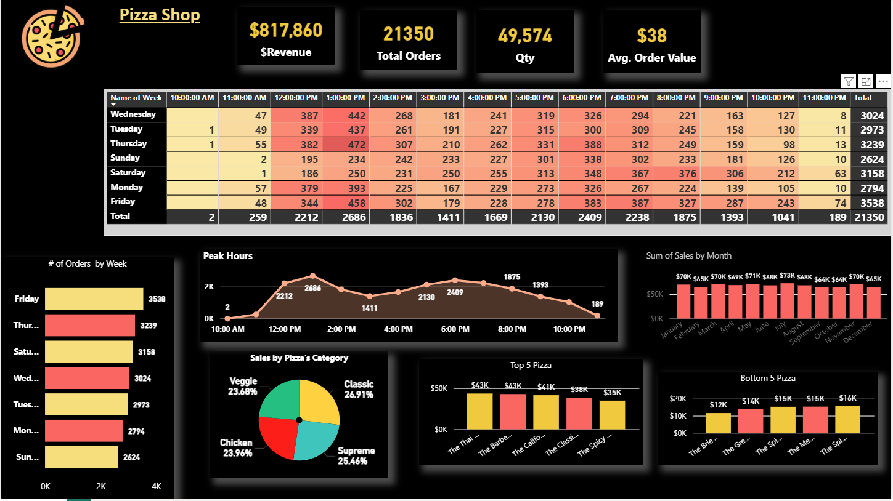
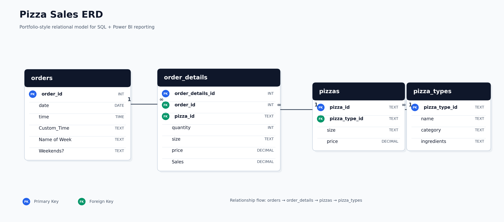

# Pizza Sales Analysis | SQL + Power BI

An end-to-end analytics project transforming transactional sales data into actionable business insights using SQL and Power BI.

This project analyses 21K+ orders and $817K+ revenue, focusing on product performance, customer ordering behaviour, and peak trading patterns to support data-driven decision-making.

---

## Project Summary

This project simulates a real-world Business Intelligence workflow:

- Structuring and modelling relational data  
- Analysing sales performance using SQL  
- Developing key business metrics (KPIs)  
- Delivering insights through an executive Power BI dashboard  

The focus is not only on building visuals, but on demonstrating the ability to connect data, business questions, and decision-making.

---

## Dataset

The dataset consists of four relational tables:

- **orders** – order-level data (date, time, weekday)  
- **order_details** – transaction-level sales records  
- **pizzas** – product and pricing information  
- **pizza_types** – category and product descriptions  

This structure reflects a **fact + dimension model**, commonly used in business reporting environments.

---

## Business Questions

This project addresses key business questions:

- What is the total revenue and average order value?  
- Which pizza categories and products drive revenue?  
- When are peak sales hours and busiest days?   
- Where are the opportunities to optimise sales performance?  

---

## Dashboard Preview



---

## Key Insights from Dashboard

- Sales activity peaks during **midday and early evening**, indicating strong lunch and dinner demand cycles  
- The **Classic category** consistently generates the most revenue across all periods  
- **Friday** shows the highest order volume, highlighting end-of-week demand spikes  
- A small group of pizzas drives a significant share of revenue, indicating product concentration  

These patterns highlight clear opportunities to optimise **staffing, promotions, and product focus** during peak trading periods.

---

## Data Model



---

## SQL Scope

The SQL component of this project includes:

- table creation and data structuring  
- joining datasets using business keys  
- KPI calculations (revenue, order volume, AOV)  
- sales trend analysis by category, time, and product  
- reusable queries and views for reporting  

---

## Repository Structure


```bash
pizza-sales-sql-powerbi/
│
├── Data/
├── Sql/
├── Powerbi/
├── Images/
└── README.md
